# 🌿 Plant-Species-Image-Classification

## A. Project Overview

This project focuses on building an image classification model for commonly used **Philippine medicinal plants**. The dataset consists of plant images collected from online sources and organized into 20 different plant species classes.

The purpose of this project is to train a machine learning model capable of accurately identifying medicinal plants based on visual features such as leaf shape, color, texture, and structure. This project demonstrates the application of image classification techniques in agriculture, healthcare, and educational contexts.

---

## B. Plant Species

Below are the 20 medicinal plant species included in the dataset. Each class contains representative images used for training and evaluation.

### 1. Oregano

- **Scientific Name:** *Plectranthus amboinicus*
- **Description:** A medicinal herb commonly used in the Philippines to treat coughs, colds, and respiratory conditions.

### 2. Peppermint

- **Scientific Name:** *Mentha × piperita*
- **Description:** An aromatic plant used for digestion relief and as a natural remedy for headaches.

### 3. Clove

- **Scientific Name:** *Syzygium aromaticum*
- **Description:** A flowering plant whose dried flower buds are used for pain relief and oral health.

### 4. Hilbas

- **Scientific Name:** *Artemisia vulgaris*
- **Description:** Traditionally used to reduce inflammation and treat digestive issues.

### 5. Mango Leaves

- **Scientific Name:** *Mangifera indica*
- **Description:** Leaves are used in traditional medicine for diabetes and respiratory problems.

### 6. Pandan

- **Scientific Name:** *Pandanus amaryllifolius*
- **Description:** Known for its fragrance and medicinal properties for pain and headaches.

### 7. Aloe Vera

- **Scientific Name:** *Aloe vera*
- **Description:** Widely used for skin treatment, burns, and wound healing.

### 8. Anise

- **Scientific Name:** *Pimpinella anisum*
- **Description:** Used to aid digestion and relieve bloating.

### 9. Calamansi

- **Scientific Name:** *Citrus microcarpa*
- **Description:** A native citrus fruit used for immunity and respiratory relief.

### 10. Ampalaya

- **Scientific Name:** *Momordica charantia*
- **Description:** Known for helping regulate blood sugar levels.

### 11. Guyabano Leaves

- **Scientific Name:** *Annona muricata*
- **Description:** Traditionally used to boost immunity and promote relaxation.

### 12. Banana Leaves

- **Scientific Name:** *Musa spp.*
- **Description:** Used in traditional medicine and food preparation.

### 13. Santol Leaves
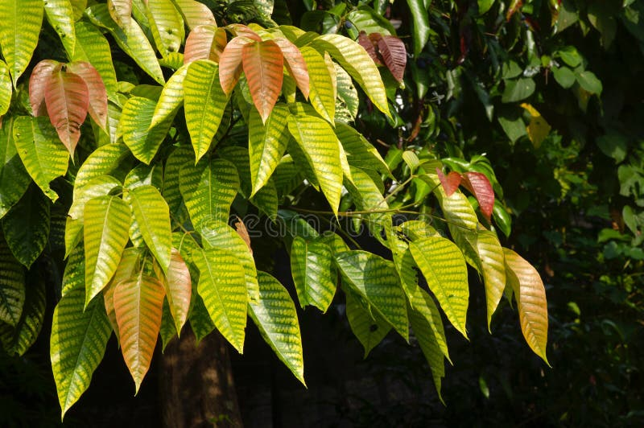
- **Scientific Name:** *Sandoricum koetjape*
- **Description:** Leaves are used for digestive and anti-inflammatory remedies.

### 14. Guava Leaves

- **Scientific Name:** *Psidium guajava*
- **Description:** Commonly used for treating diarrhea and wound cleansing.

### 15. Ipil-Ipil Leaves

- **Scientific Name:** *Leucaena leucocephala*
- **Description:** Used for antibacterial and anti-inflammatory purposes.

### 16. Kangkong

- **Scientific Name:** *Ipomoea aquatica*
- **Description:** A leafy vegetable with nutritional and medicinal value.

### 17. Alugbati

- **Scientific Name:** *Basella alba*
- **Description:** Used for digestive health and skin conditions.

### 18. Lemongrass

- **Scientific Name:** *Cymbopogon citratus*
- **Description:** Known for its antibacterial and calming properties.

### 19. Malunggay
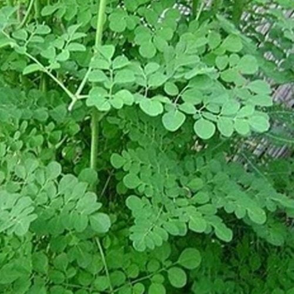
- **Scientific Name:** *Moringa oleifera*
- **Description:** Highly nutritious plant used to boost immunity.

### 20. Ginseng

- **Scientific Name:** *Panax ginseng*
- **Description:** Used to increase energy and improve overall health.

---

## C. Model Training Details

The image classification model was trained using the following parameters:

These parameters were selected to balance learning efficiency, model accuracy, and prevention of overfitting.

---

## D. Model Evaluation

The model’s performance was evaluated using standard classification metrics.

### Evaluation Outputs:
- **Confusion Matrix**
- **Accuracy per Class**
- **Overall Model Accuracy**

## E. Model Testing

To verify the real-world performance of the trained model, testing was conducted using unseen images through the **Preview** section of the application. These test images were not included in the training or validation datasets.

Below are 10 sample screenshots showing the model’s predictions during testing. Each screenshot demonstrates the model’s ability to classify different plant species based on visual input.

### Testing Screenshots

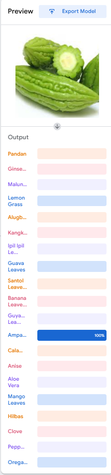
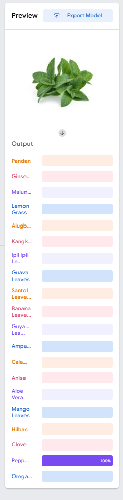
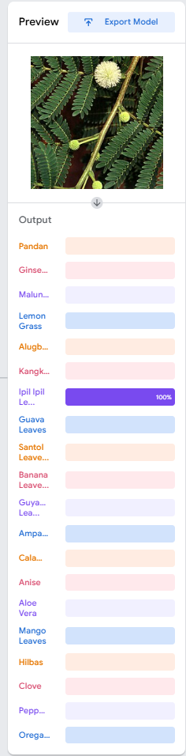
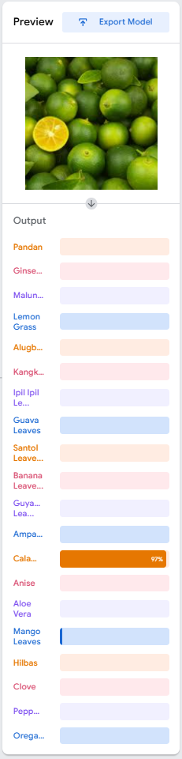
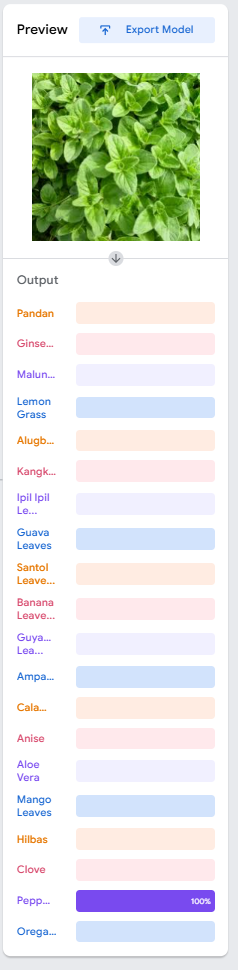
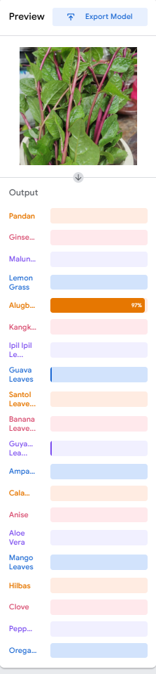
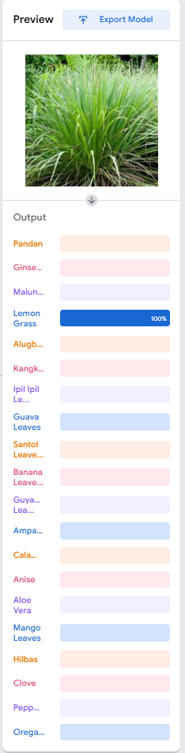

These testing results indicate that the model can correctly identify medicinal plant species with a high level of accuracy, demonstrating its effectiveness for practical and educational use.

### Screenshots:
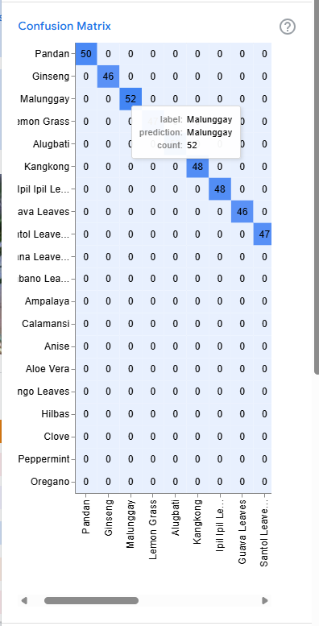

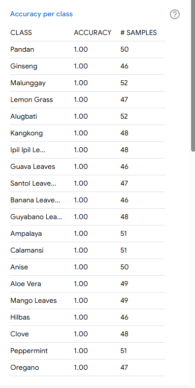

---

## Reflection

### 1. How did the number of images per class affect your model’s accuracy?
Having more images per class improved the model’s accuracy because it allowed the model to learn different variations such as lighting, angles, and backgrounds. Classes with fewer images were more likely to be misclassified.

### 2. Which plant species were most commonly misclassified and why?
Plant species with similar visual features were most commonly misclassified. For example, guava leaves and santol leaves were sometimes confused due to their similar shape and texture.

### 3. How did changing the epochs, batch size, or learning rate affect the training results?
Increasing the number of epochs helped the model learn better, but too many epochs caused overfitting. A batch size of 32 provided stable training, while a learning rate of 0.001 allowed efficient learning without instability.

### 4. What challenges did you encounter during dataset collection and labeling?
Some challenges included finding high-quality images, removing duplicates, and correcting mislabeled data. Variations in background and lighting also required manual cleaning of the dataset.

### 5. If you were to improve your model, what specific changes would you make and why?
The model could be improved by adding more high-quality images per class, applying stronger data augmentation, and using a more advanced pretrained model to improve accuracy.

## Conclusion

The trained model demonstrates effective classification of Philippine medicinal plants and can serve as a foundation for future applications such as mobile plant identification systems and educational tools.
